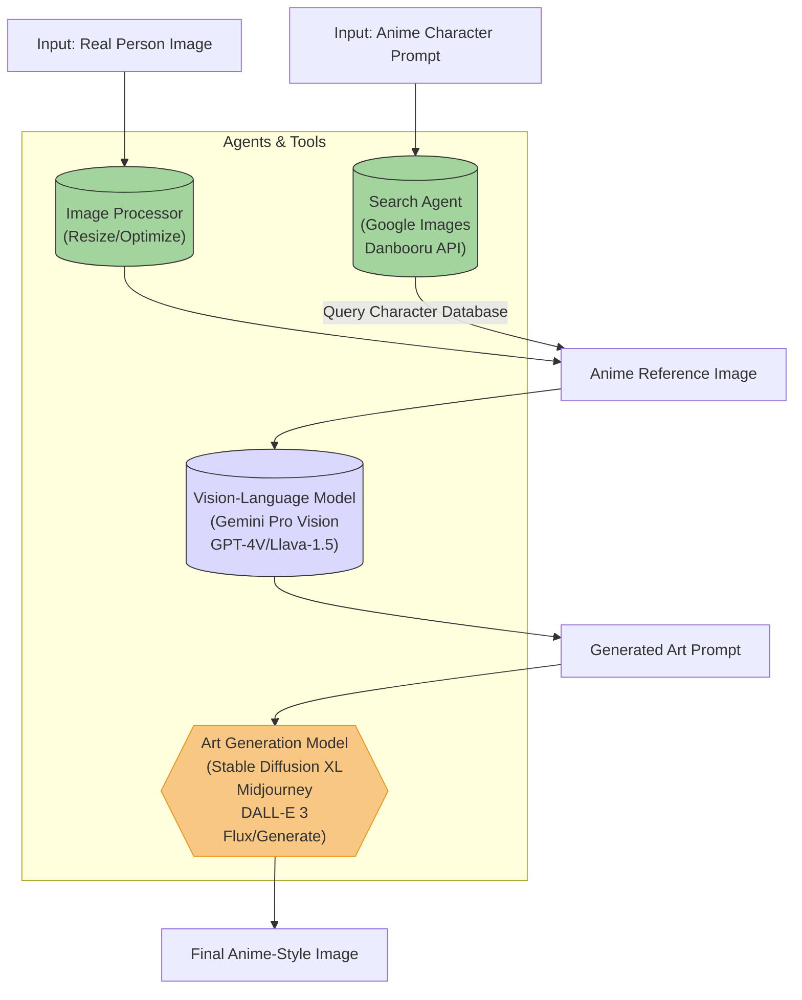

# Possible NYP OH showcase project - nyp-me-generator
* take an image of a person or get one somehow
* given an existing image and a prompt of an anime character,
* search up the character → get an image of them
* get a VLM to create a prompt for an art generation tool to recreate an image of it
* pass that prompt into an art / image editing model like:
	* gpt-image-1
	* flux kontext
	* gemini 2.0 flash image generation
* print the image out on a postal card

## Plan
1. **Inputs**:
   - `Real Person Image`: User-provided photo
   - `Anime Character Prompt`: Text description of target character (e.g., "Megumin from Konosuba")

2. **Pre-processing**:
   - `Image Processor`: Prepares the photo (resizing, cropping) for VLM input
   - `Search Agent`: Uses character prompt to fetch anime reference image from databases like Danbooru or Google Images

3. **Prompt Engineering**:
   - `Vision-Language Model`: Analyzes both images and generates an art prompt containing:
     - Physical features from real photo
     - Art style from anime reference
     - Details like "anime cell-shaded", "bold outlines", "vibrant colors"
   *(Example output: "20yo man with glasses and curly hair in Megumin's explosion-mage style, dynamic pose, anime shading, detailed eyes, konosuba aesthetic")*

4. **Image Generation**:
   - `Art Generation Model`: Uses fine-tuned anime models (e.g. Waifu Diffusion) to create final artwork. May use:
     - **ControlNet** for pose replication
     - **IP-Adapter** for style transfer
     - **LoRA** weights for character consistency

5. **Output**:
   - Final anime-style image preserving the person's identity with the target character's art style

### Tools Summary:
| Component       | Example Tools                                                                 |
|-----------------|------------------------------------------------------------------------------|
| **Search**      | Google Images API, Danbooru, Saucenao Reverse Image Search                  |
| **VLM**         | Gemini Pro Vision, GPT-4V, LLaVA-1.5, CogVLM                                |
| **Art Gen**     | Flux/Generate, Stable Diffusion XL, DALL-E 3, Midjourney, NovelAI           |
| **Enhancements**| ControlNet (pose), IP-Adapter (style), LoRA (character consistency)         |

# Chart

